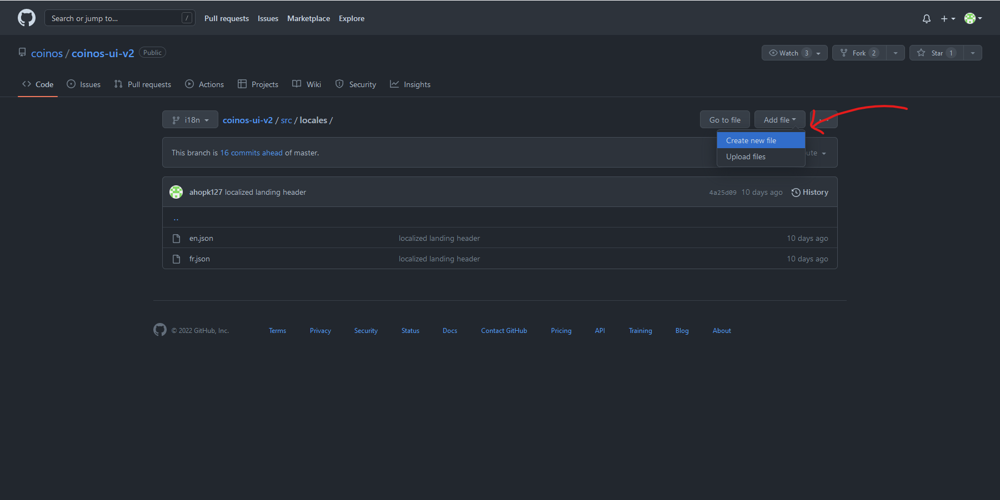

# swapee Internationalization

swapee can be translated into other languages by editing [JSON](https://www.json.org/json-en.html) files. You do not need programming knowledge to do this, or to use these instructions. Here are instructions on how to translate swapee:

_NOTE: This guide was written for people without a technical background. If you want more technical details, click [here](./i18n-technical.md)._

These instructions assume you have a GitHub account and have permission to modify this repository. If you do not have permission, you will need to [make a fork](https://github.com/swapee/swapee-ui-v2/fork) using the link on the top-right, then follow these instructions to translate your fork, then make a pull request using the link below the "Code" button to apply your changes to the main repository.

Last Updated: 2023-01-05

## Required Background Knowledge

### Language Codes

Before you can translate swapee, you need to know the [ISO 639-1 code](https://en.wikipedia.org/wiki/ISO_639-1) of your language. This is a standard two-letter code that your browser uses to refer to a language (for example, English is `en`, and Spanish is `es`). You can also add a dash and more letters to refer to a specific region (for example, American English is `en-US`, and British English is `en-GB`). A list of all codes can be found [here](https://en.wikipedia.org/wiki/List_of_ISO_639-1_codes), and Firefox-based browsers show you the code when you are selecting your browser's language.

### Locale Files

Each translation of swapee is stored in a special _locale file_. These files can be found in the `src/locales` folder in the swapee directory. The name of these files is the language code plus "`.json`". A file might look something like this:

```JSON
{
  "howItWorks": "How it works",
  "faq": "FAQ",
  "about": "About",
  "startInSeconds": "Start in Seconds",
  "signIn": "Sign In"
}
```

Each line (other than the opening and closing braces) contains a **text name**, then a colon (`:`), then the **translated text**. All lines other than the last end in a comma. The text name is a word that is the same in all translations, and is used by the code to access that piece of text. **Both the text name and translated text must be inside quotation marks (`"`).**

### The Language List

There is also a JSON file that controls which languages are understood. It is at `src/lib/translations/lang.json` and looks something like this:

```JSON
{
  "en": "English",
  "fr": "Français",
  "es": "Español"
}
```

This file simply maps each language to its name. It is used both to get a list of languages and to get the name of each language for the language selector. If a translation is not in this file, swapee will not be able to see it.

### JSON Sections

You might notice that some of the left-text in the language files don't have a string after them, instead having some `{}` curly brackets, like in this example:

```JSON
"nav": {
  "startInSeconds": "Start in Seconds",
  "account": "Account",
  "signIn": "Sign In",
  "signOut": "Sign Out",
  "dashboard": "Dashboard",
  "settings": "Settings",
  "support": "Support"
},
```

These denote sections of the JSON file, which helps keep it organized. If you're translating some text that is in a section, make sure the translated text is in the same section of the new file. If that section doesn't exist, just create it.

In the translation files, sections roughly correspond to where the the text is in swapee. This can be useful if you need context for some text. Here are some of these associations (`A.B` means section `B` is located inside `A`):

| Section        | Location                                          |
| -------------- | ------------------------------------------------- |
| 404            | the 404 page                                      |
| about          | the 'About' section at the bottom of the homepage |
| error          | the error page                                    |
| faq            | the FAQ on the homepage                           |
| footer         | the bottom of the homepage                        |
| howItWorks     | the 'How it Works' section                        |
| invoice        | the Invoice page                                  |
| jobs           | the Jobs page                                     |
| landing        | the top of the homepage                           |
| login          | the Register and Login pages                      |
| user           | the user page                                     |
| user.dashboard | the user's dashboard                              |
| user.settings  | the settings page                                 |
| user.support   | the user's support page                           |
| transactions   | anything to do with transactions                  |

If you have the `grep` tool installed and know how to use a terminal, you can use it to find where a certain bit of text is being used. In the main folder (usually called `swapee-ui-v2`), you can use the following command to find where `transactions.submit` is being used, for example:

```bash
git grep "transactions.submit" src
```

### HTML Tags

Sometimes, you will see strange text surrounded with `<>` angle brackets. Every one of these "HTML tags" will be followed by another one starting with a slash. Here's an example:

```JSON
"p1": "<strong>swapee</strong> is an <strong>open source</strong> bitcoin web wallet, point of sale, ecommerce marketplace and exchange platform. Development started in Vancouver in September 2012 as a way to provide local merchants with a convenient way to accept bitcoin payments.",
```

These apply a certain style to the text between them. For example, the tags above will make "swapee" and "open source" bold, leaving the rest non-bold.

When translating strings containing tags, don't change the tags. Do translate the text between them, and don't be afraid to move them around - just make sure they contain the same part of the sentence, and that the one without the slash is always before the one with the slash. Not all of the localizable strings support HTML tags, so you shouldn't use them if they aren't in the original string you're translating.

## Creating a New Translation

Follow these steps to create a new translation. You will need a GitHub account to do this:

1. Determine the language code of your language, using [this list](https://en.wikipedia.org/wiki/List_of_ISO_639-1_codes). For these instructions, I will be using the fictional code `xx` - replace that code with the code of whatever language you are translating to.
2. Go to the `src` folder, then the `locales` folder, then create a file `xx.json` inside that folder using either a text editor (e.g. Notepad), or GitHub.
   
3. Copy the text from `en.json` into this new file.
4. Translate all of the pieces of text on the right. **Do not translate or alter in any way the pieces of text on the left, or any line that doesn't have two pieces of text!**  
   _NOTE: "swapee" is a feminine noun in languages with grammatical gender._  
   _NOTE: The system will not break if you miss any translation. Instead, it will use the English version of that text._
   
5. Scroll down and use the green button to commit the file.
6. Go to the `src` folder again, then `lib`, then `translations`, then `lang.json`.
7. Use the pencil icon on the top-right to edit the file, then add a new line containing your language code in quotes, followed by a colon, followed by the full name of your language in quotes. Make sure every line except the last has a comma at the end.
8. Commit your changes like you did in step 5.

## Adding to an Existing Translation

Follow these steps to add to an existing translation. You will also need a GitHub account to do this:

1. Determine the language code of your language, using [this list](https://en.wikipedia.org/wiki/List_of_ISO_639-1_codes). For these instructions, I will be using the fictional code `xx` - replace that code with the code of whatever language you are translating to.
2. Go to the `src` folder, then `locales`, then `en.json`.
3. Find the line with the piece of text that you want to translate.
4. Find your translation's file, at `src/locales/xx.json`.
5. Use the pencil icon on the top-right to edit the file.
6. Add the whole line (both left and right parts) from step 3 to this file, in between the `{}` braces. Make sure the previous line has a comma at the end, and that it is in the same place as before (i.e. inside the same set of `{}` braces - if they don't exist, create them).
7. Translate the piece of text on the right, keeping the quotes surrounding it. **Do not translate or alter in any way the piece of text on the left, or any line that doesn't have two pieces of text!**  
   _NOTE: "swapee" is a feminine noun in languages with grammatical gender._
8. Repeat steps 3-7 for every piece of text you want to translate (you should probably open `en.json` in another tab, so that your changes from step 6 aren't erased).
9. Scroll down and use the green button to commit the file.

## The Guided Translation Script

There is also a program that helps you translate automatically - all you have to do is input the translated text and it will do the rest for you! You need a bit of technical knowledge to use it however, specifically, you need to know:

- How to use basic [git](https://git-scm.com/) (cloning, pulling, committing, pushing)
- How to run a [Python](https://www.python.org/) script

The script also shows you the ID of each bit of text you are translating, so that you can know where it is. `A.B` means string `B` in section `A`, `A.B.C` means string `C` in subsection `B` in section `A`, etc.

Clone the repository, then use the guided translation script (at `src/locales/guided_translation.py`) to update the translation files. You will need to pull before running, and commit/push your changes in order for them to be applied to swapee.
