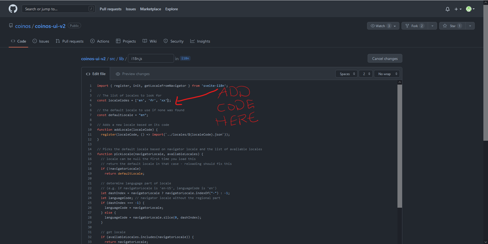

# CoinOS Internationalization

CoinOS can be translated into other languages by editing JSON files. You do not need programming knowledge to do this, or to use these instructions. Here are instructions on how to internationalize CoinOS:

_NOTE: This guide was written for people without a technical background. If you want more technical details, click [here](./i18n-technical.md)._

## Required Background Knowledge

### Language Codes

Before you can translate CoinOS, you need to know the [ISO 639-1 code](https://en.wikipedia.org/wiki/ISO_639-1) of your language. This is a standard two-letter code that your browser uses to refer to a language (for example, English is `en`, and French is `fr`). You can also add a dash and more letters to refer to a specific region (for example, American English is `en-US`, and British English is `en-GB`). A list of all codes can be found [here](https://en.wikipedia.org/wiki/List_of_ISO_639-1_codes), and Firefox-based browsers show you the code when you are selecting your browser's language.

### Locale Files

Each translation of CoinOS is stored in a special _locale file_. These files can be found in the `src/locales` folder in the CoinOS directory. The name of these files is the language code plus "`.json`". A file might look something like this:

```JSON
{
  "howItWorks": "How It Works",
  "faq": "FAQ",
  "about": "About",
  "startInSeconds": "Start in Seconds",
  "signIn": "Sign In"
}
```

Each line (other than the opening and closing braces) contains a **text name**, then a colon (`:`), then the **translated text**. All lines other than the last end in a comma. The text name is a word that is the same in all translations, and is used by the code to access that piece of text. **Both the text name and translated text must be inside quotation marks (`"`).**

### The Language List

At the top of the file `src/lib/i18n.js`, there is a list of translations that looks something like this:

```js
// The list of locales to look for
// ADD ALL NEW LANGUAGE CODES TO THIS LIST
const localeCodes = ['en', 'fr'];
```

In order for a translation to be recognized by the CoinOS system, you need to add it to this list. At the end of the list, before the second square bracket, add a comma, then a space, then the language code in quotation marks.

## Creating a New Translation

Follow these steps to create a new translation. You will need a GitHub account to do this:

1. Determine the language code of your language, using [this list](https://en.wikipedia.org/wiki/List_of_ISO_639-1_codes). For these instructions, I will be using the fictional code `xx` - replace that code with the code of whatever language you are translating to.
2. Go to the `src` folder, then the `locales` folder, then create a file `xx.json` inside that folder using either a text editor (e.g. Notepad), or GitHub.
   
3. Copy the text from `en.json` into this new file.
4. Translate all of the pieces of text on the right. **Do not translate or alter in any way the pieces of text on the left, or any line that doesn't have two pieces of text!**  
   _NOTE: "CoinOS" is a feminine noun in languages with grammatical gender._
   
5. Scroll down and use the green button to commit the file.
6. Go to the `src` folder again, then `lib`, then `i18n.js`.
7. Use the pencil icon on the top-right to edit the file, then add your language code (**in quotation marks**) to the list.
   
8. Commit your changes like you did in step 5.

## Adding to an Existing Translation

Follow these steps to add to an existing translation. You will also need a GitHub account to do this:

1. Determine the language code of your language, using [this list](https://en.wikipedia.org/wiki/List_of_ISO_639-1_codes). For these instructions, I will be using the fictional code `xx` - replace that code with the code of whatever language you are translating to.
2. Go to the `src` folder, then `locales`, then `en.json`.
3. Find the line with the piece of text that you want to translate.
4. Find your translation's file, at `src/locales/xx.json`.
5. Use the pencil icon on the top-right to edit the file.
6. Add the whole line (both left and right parts) from step 3 to this file, in between the `{}` braces. Make sure the previous line has a comma at the end, and that it is in the same place as before (i.e. inside the same set of `{}` braces - if they don't exist, create them).
7. Translate the piece of text on the right, keeping the quotes surrounding it. **Do not translate or alter in any way the piece of text on the left, or any line that doesn't have two pieces of text!**  
   _NOTE: "CoinOS" is a feminine noun in languages with grammatical gender._
8. Repeat steps 3-7 for every piece of text you want to translate (you should probably open `en.json` in another tab, so that your changes from step 6 aren't erased).
9. Scroll down and use the green button to commit the file.
